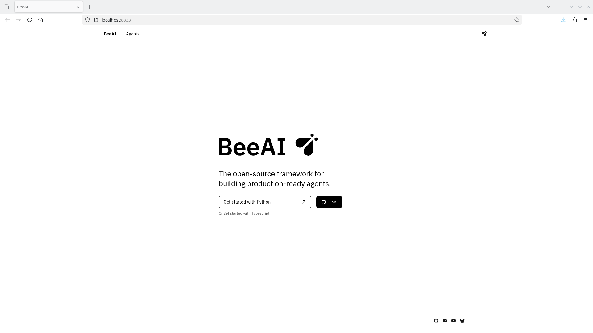
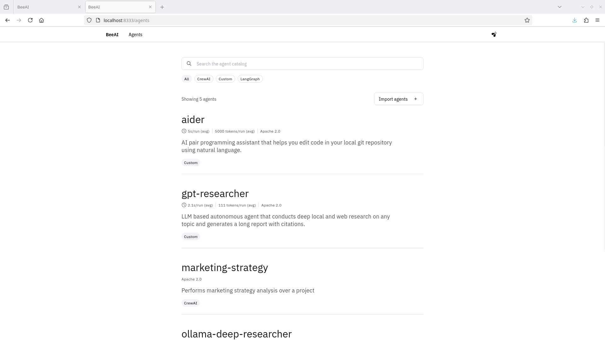
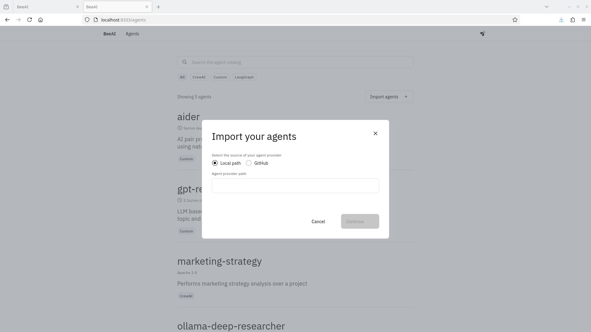
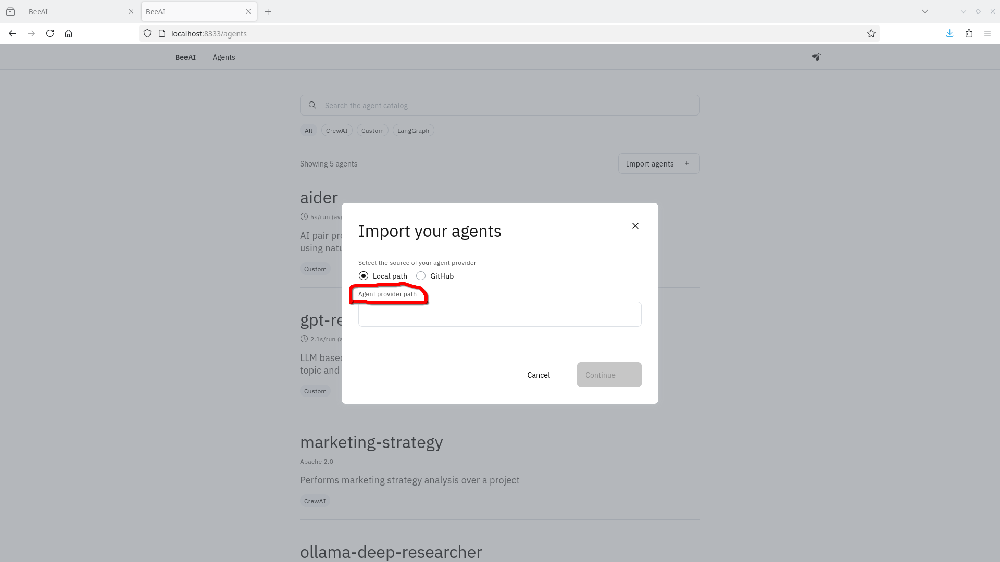
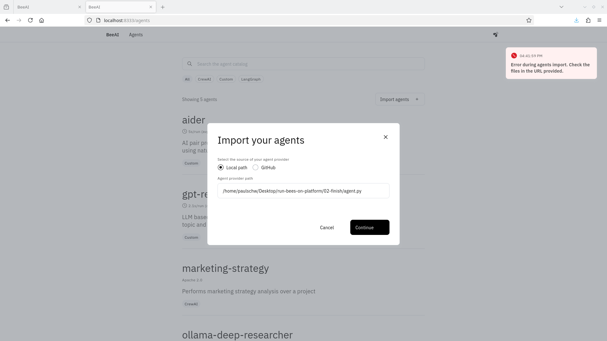
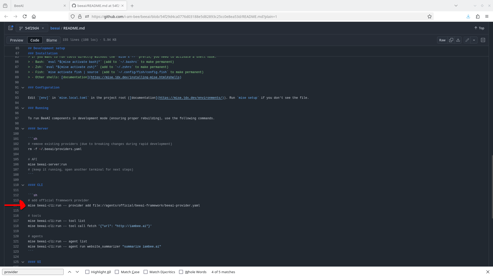
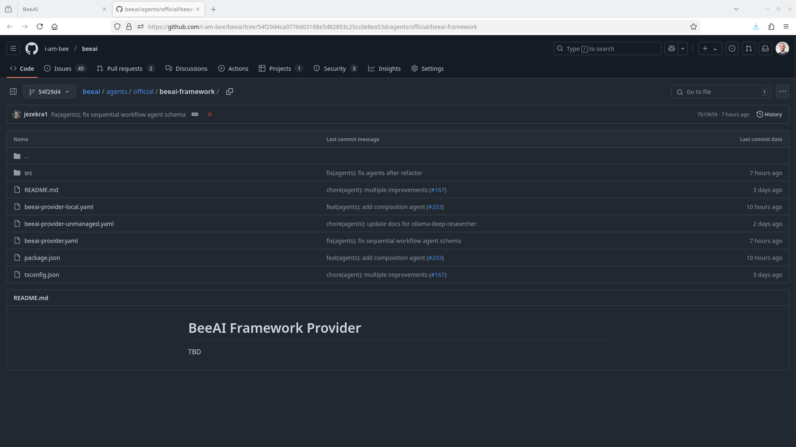
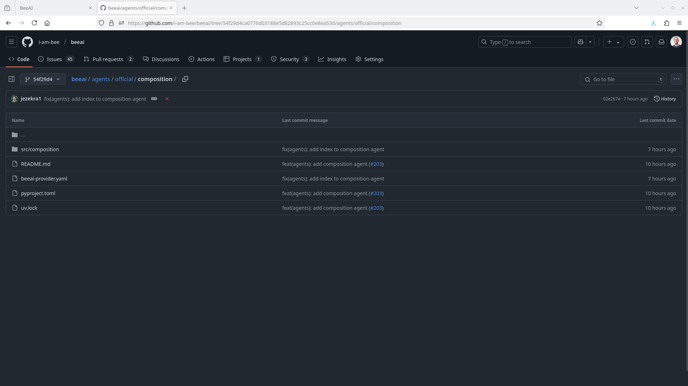

# Let's take a simple Bee agent and run it on the platoform~!

This repo documents my attempts to take a [simple Bee agent](https://raw.githubusercontent.com/i-am-bee/beeai-framework/b6e5aa7a2cecf1003ab0313ac0c001fe5a2407fd/python/examples/agents/simple.py) and run it on the [BeeAI platform](https://github.com/i-am-bee/beeai/tree/54f29d4ca0776d03188e5d82893c25cc0e8ea53d). Let's see what happens!

## Before we begin

This repo has two subdirectories:

* `01-start` contains the code for the agent we're going to use for this experiment
* `02-finish` will have the final form of code, so the agent + any needed changes and any other files we had to write to run on the platform. This will basically be our working directory

You'll also need to have a few prerequisites in order to play the home game:

* Linux (I have Fedora 40 using 6.13.4 kernel, Mac or WSL could probably be ok too)
* Proprietary NVIDIA drivers :(
* Python (my version is 3.12.9, others could be ok too)
* Ollama (my version is 0.5.7, others could be ok too)


## Setting things up

First things first: let's move into our working directory and set up a virtual environment

```bash
git clone git@github.com:psschwei/run-bees-on-platform.git
cd 02-finish
python -m venv venv
source venv/bin/activate
```

Then we'll install the `beeai-framework` for python:

```bash
pip install beeai-framework==0.1.1
```

As of this writing, the framework is alpha and changing frequently, so you probably want to pin to this specific version.

At this point, we should be able to run a Bee agent. We'll use the sample [simple Bee agent](https://raw.githubusercontent.com/i-am-bee/beeai-framework/b6e5aa7a2cecf1003ab0313ac0c001fe5a2407fd/python/examples/agents/simple.py) from the beeai-framework repo, which I've added here in the `01-start` directory. Note that I am using the `b6e5aa7` commit and not the main branch.

```bash
cp ../01-start/agent.py .
```

Okay, that should be all we need for now, let's try running our agent.

```bash
python agent.py
```

Output should look something like this:

> Agent(thought) 🤖 :  I need to use the OpenMeteoTool to get the current weather information for Las Vegas.
> Agent(tool_name) 🤖 :  OpenMeteoTool
> Agent(tool_input) 🤖 :  {'location_name': 'Las Vegas', 'temperature_unit': 'celsius'}
> Agent(tool_output) 🤖 :  {"latitude": 36.16438, "longitude": -115.14392, "generationtime_ms": 0.07355213165283203, "utc_offset_seconds": 0, "timezone": "GMT", "timezone_abbreviation": "GMT", "elevation": 609.0, "current_units": {"time": "iso8601", "interval": "seconds", "temperature_2m": "\u00b0C", "rain": "mm", "relative_humidity_2m": "%", "wind_speed_10m": "km/h"}, "current": {"time": "2025-02-27T20:45", "interval": 900, "temperature_2m": 21.3, "rain": 0.0, "relative_humidity_2m": 8, "wind_speed_10m": 23.6}, "daily_units": {"time": "iso8601", "temperature_2m_max": "\u00b0C", "temperature_2m_min": "\u00b0C", "rain_sum": "mm"}, "daily": {"time": ["2025-02-27"], "temperature_2m_max": [23.7], "temperature_2m_min": [10.2], "rain_sum": [0.0]}}
> Agent(thought) 🤖 :  The OpenMeteoTool returned the current weather information for Las Vegas, which is 21.3°C with a relative humidity of 8%. I should provide this information in a concise and clear manner to the user.
> Agent(final_answer) 🤖 :  The current temperature in Las Vegas is 21.3°C, with a relative humidity of 8%.
> Agent 🤖 :  The current temperature in Las Vegas is 21.3°C, with a relative humidity of 8%.

Note: our agent uses the `granite3.1-dense:8b` model, so if you don't already have that on your system you'll need to run `ollama pull granite3.1-dense:8b` to get it

Ok, great, we've run an agent on our laptop. That's (mostly) trivial. Now let's see what it takes to get it working on the BeeAI platform.

## Setting up the BeeAI platform

The first thing we need to do is install the BeeAI platform. There are a variety of ways to [install](https://github.com/i-am-bee/beeai/tree/54f29d4ca0776d03188e5d82893c25cc0e8ea53d?tab=readme-ov-file#installation). Since I'm using Linux, I'll skip Brew and go straight for pip:

```bash
pip install beeai-cli
```

For reference, this installed v0.0.3 of the cli, v0.0.5 of the sdk, and v0.0.2 of the server.

Per the readme instructions, we need to run the server in a separate terminal window, so let's do that now.

```bash
# In a separate terminal window (make sure to activate venv too)
beeai serve
```

If this worked, I should be able to access the BeeAI web interface at `http://localhost:8333`...



Awesome! Let's get started with Python (*clicks on "Get Started with Python" button*...)


That didn't seem to do anything, just open a new tab to the same page... turns out we need to click on the "Agents" link at the top of the page. We do that and we come to this page



Ok, now we're in business. There's a link near the top of the screen to "Import agents", let's give that a try



Since we're going to try using the simple agent we copied from the beeai-framework examples, we'll use the local option for now....



but it seems like it's asking for the path to the "provider" not our agent (and providing a link to the agent source code doesn't work)...



So, what's a provider?


## Looking for a provider

Thought one: let's check the [docs](https://github.com/i-am-bee/beeai/tree/54f29d4ca0776d03188e5d82893c25cc0e8ea53d/docs), but as of now those are still a work in progress. Still, there's a [create-agents](https://github.com/i-am-bee/beeai/tree/54f29d4ca0776d03188e5d82893c25cc0e8ea53d/docs/create-agents) subdirectory, though it only has agent source code examples (which isn't any different than our little agent.py that we want to run), so no luck here.

Thought two: let's search the README for the word "provider"... and that gives us this line:



If we follow the filepath we find this directory



Looking at the `beeai-provider.yaml` file, we see this:

```yaml
manifestVersion: 1
driver: nodejs
package: "git+https://github.com/i-am-bee/beeai@agents-v0.0.15#path=agents/official/beeai-framework"
serverType: http
mcpTransport: sse
mcpEndpoint: /sse
```

And looking at the contents of the directory, I see

```
.
├── beeai-provider-local.yaml
├── beeai-provider-unmanaged.yaml
├── beeai-provider.yaml
├── package.json
├── README.md
├── src
│   ├── chat
│   │   ├── chat.ts
│   │   ├── LICENSE
│   │   └── README.md
│   ├── config.ts
│   ├── content-judge
│   │   ├── content-judge.ts
│   │   ├── LICENSE
│   │   └── README.md
│   ├── podcast-creator
│   │   ├── LICENSE
│   │   ├── podcast-creator.ts
│   │   └── README.md
│   └── server.ts
└── tsconfig.json
```

Hmm, this is TypeScript, and I'm writing Python... wonder if there's a Python one agent I can use instead... let's check out the composition agent...



Ok, think we're back in business now. Let's see what it takes to create a provider...
